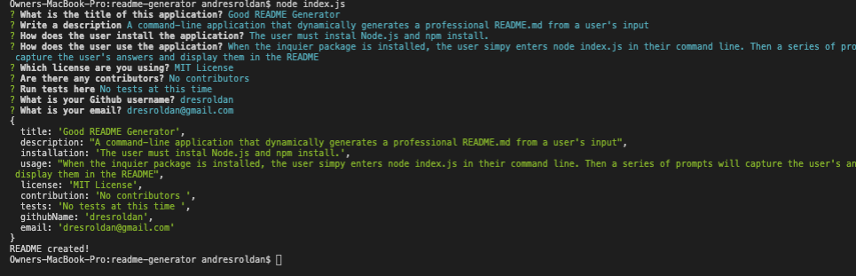
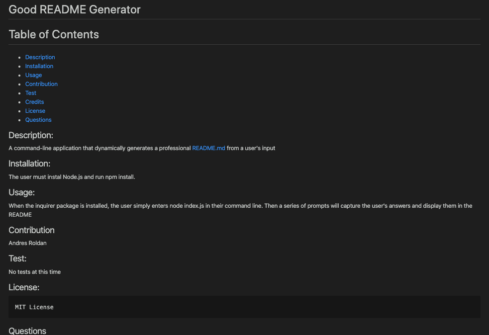

# Good README Generator

  # Table of Contents 

  - [Description](#description)
  - [Installation](#installation)
  - [Usage](#usage)
  - [Contribution](#contribution)
  - [Test](#test)
  - [Credits](#credits)
  - [License](#license)
  - [Questions](#questions)
  
  ## Description:
  A command-line application that dynamically generates a professional README.md from the user's input.
  
    

 ## Installation:
  The user must instal Node.js and run npm install.
  ## Usage:
  Once the inquirer package is installed, the user simply enters node index.js in their command line. Then a series of prompts will capture the user's answers and display them in the README.
  ## Contribution:
  Andres Roldan
  ## Test:
  No tests at this time. 
 ## License:
    MIT License
  
  ## Questions:
  For more questions about this application, please contact me at:
  
  * [Github Profile](http://github.com/dresroldan)
  * dresroldan@gmail.com
      
  